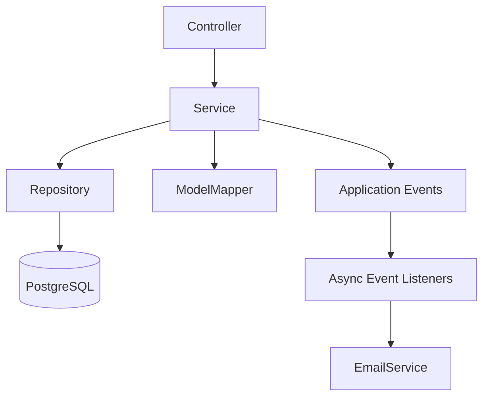
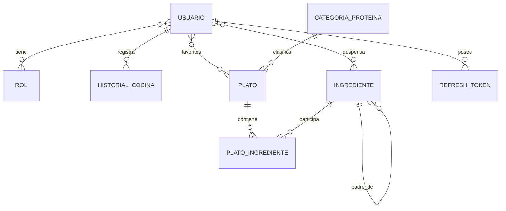

# Manka — Backend API de Recomendación de Platos

Manka es una API REST desarrollada con Spring Boot para recomendar platos en función de los ingredientes disponibles del usuario, el tiempo máximo de preparación y su historial de cocina.

El sistema mantiene un catálogo de recetas e ingredientes, permite gestionar despensa, favoritos e historial, y utiliza un motor de recomendación que puntúa los platos considerando cobertura de ingredientes, tiempo disponible, variedad de proteína, popularidad y repetición reciente.

---

## Integrantes

- Juan Carlos Sebastian Lescano Garamendi — 202510447
- Luis Eduardo Strater Mc Lellan — 201810246
- Francisco José Lira Francia — 201910540
- Pablo Cesar Vega del Castillo — 202310650

---

## Tecnologías utilizadas

- Java 21
- Spring Boot 4.0.0
- Spring Web MVC
- Spring Data JPA
- Spring Security
- OAuth2 Resource Server
- JWT con claves RSA
- PostgreSQL
- ModelMapper
- Jakarta Validation
- Spring Events
- `@Async`
- JavaMailSender
- Thymeleaf
- Maven
- Docker / Docker Compose
- Testcontainers
- JUnit 5
- MockMvc
- Postman
- Mailpit
- Railway

---

## Fuente de datos

El catálogo inicial de Manka fue ampliado utilizando como fuente el dataset público:

**RecetasDeLaAbuela — SomosNLP**  
https://huggingface.co/datasets/somosnlp/RecetasDeLaAbuela

El archivo CSV original contiene recetas en español con información como nombre, ingredientes, pasos de preparación, duración, categoría, dificultad y otros campos.

Para adaptarlo al modelo de datos de Manka se realizó un proceso de transformación y normalización:

1. Se seleccionaron 200 recetas del dataset.
2. Se normalizaron los nombres de ingredientes para reducir duplicados.
3. Se reutilizaron ingredientes ya existentes en Manka cuando fue posible.
4. Se convirtió la duración de las recetas a minutos.
5. Se normalizaron los niveles de dificultad a `FACIL`, `MEDIA` y `DIFICIL`.
6. Se transformó la valoración disponible a un `popularity_score` de 0 a 100.
7. Se clasificaron las recetas según las categorías de proteína utilizadas por Manka.
8. Se transformaron los pasos de preparación a texto compatible con PostgreSQL.
9. Se generaron las relaciones entre platos e ingredientes.
10. Se conservaron las 12 recetas originales del proyecto.

El catálogo utilizado actualmente contiene **212 platos**: 12 recetas originales de Manka y 200 recetas adaptadas del dataset.

> El dataset externo se utilizó únicamente como fuente de datos. La estructura de base de datos, normalización, clasificación, lógica de recomendación y adaptación al dominio de Manka fueron implementadas específicamente para este proyecto.

---

## Funcionalidades principales

- Registro e inicio de sesión de usuarios.
- Autenticación mediante JWT.
- Refresh tokens con rotación y revocación.
- Roles `USER` y `ADMIN`.
- Consulta de ingredientes.
- Búsqueda de ingredientes por texto.
- Consulta de platos.
- Filtro de platos por tiempo máximo de preparación.
- Motor de recomendación personalizado.
- Gestión de despensa.
- Historial de platos cocinados.
- Penalización de platos cocinados recientemente.
- Gestión de favoritos.
- Endpoints administrativos.
- Eventos de dominio asíncronos.
- Envío de correos de bienvenida y notificaciones.
- Manejo global de excepciones.
- Validaciones de requests.
- Pruebas unitarias, de integración y de API.

---

## Motor de recomendación

El motor de recomendación asigna un puntaje de 0 a 100 a cada plato candidato.

Entre los factores considerados se encuentran:

- cobertura de ingredientes disponibles;
- compatibilidad con el tiempo máximo indicado;
- variedad de categoría de proteína;
- penalización por repetición reciente;
- popularidad del plato.

Además:

- un plato nunca puede superar el `availableMinutes` solicitado;
- se descartan platos con cobertura de ingredientes igual a 0;
- los resultados se ordenan de mayor a menor puntaje;
- el historial del usuario modifica el ranking para evitar recomendaciones repetitivas.

Ejemplo de request:

```json
{
  "ingredientIds": [1, 4, 5, 6, 7, 8],
  "availableMinutes": 20,
  "limit": 10
}
```

---

## Arquitectura

El backend sigue una arquitectura por capas:

```text
Controller
    ↓
Service
    ↓
Repository
    ↓
PostgreSQL
```

Los DTOs se utilizan para separar la representación externa de las entidades JPA.



---

## Diagrama simplificado de entidades



Entidades principales:

- `Usuario`
- `Rol`
- `RefreshToken`
- `Plato`
- `Ingrediente`
- `PlatoIngrediente`
- `CategoriaProteina`
- `HistorialCocina`

---

## Seguridad

La API utiliza Spring Security junto con JWT firmado mediante claves RSA.

Los usuarios registrados públicamente reciben el rol:

```text
USER
```

Los usuarios administrativos pueden tener:

```text
ADMIN
```

Los JWT incluyen los roles del usuario y son utilizados por Spring Security para autorizar los endpoints protegidos.

También se implementaron refresh tokens opacos almacenados de forma segura mediante hash SHA-256.

Características:

- access token JWT;
- refresh token rotativo;
- revocación de refresh token;
- endpoint de logout;
- endpoints protegidos por rol;
- contraseñas almacenadas con BCrypt.

---

## Eventos asíncronos

Manka utiliza eventos de dominio para desacoplar determinadas acciones secundarias del flujo principal.

Eventos implementados:

- `UserRegisteredEvent`
- `DishCookedEvent`
- `FavoriteAddedEvent`

Los listeners se ejecutan después del commit de la transacción mediante:

```bash
@TransactionalEventListener(phase = TransactionPhase.AFTER_COMMIT)
```

y de forma asíncrona utilizando:

```bash
@Async("mankaTaskExecutor")
```

En desarrollo local se puede utilizar Mailpit para inspeccionar los correos enviados.

---

# Ejecución local

## Requisitos

Antes de ejecutar el proyecto se necesita:

- Java 21 o superior
- Maven
- Docker
- Docker Compose

Verificar:

```bash
java -version
mvn -version
docker --version
docker compose version
```

---

## 1. Clonar el repositorio

```bash
git clone <https://github.com/fran-li/manka>
cd manka-java-backend
```

---

## 2. Variables de entorno

Crear un archivo `.env` en la raíz del proyecto.

Ejemplo:

```env
DB_URL=jdbc:postgresql://localhost:5433/manka
DB_USERNAME=postgres
DB_PASSWORD=postgres

MAIL_ENABLED=false
MAIL_HOST=localhost
MAIL_PORT=1025

MANKA_ADMIN_EMAIL=admin@manka.local
MANKA_ADMIN_PASSWORD=Admin123
MANKA_ADMIN_FIRST_NAME=Manka
MANKA_ADMIN_LAST_NAME=Admin
```

No se deben subir contraseñas reales ni secretos al repositorio.

La configuración utiliza valores de entorno para mantener separados los datos sensibles del código fuente.

---

## 3. Levantar PostgreSQL

```bash
docker compose up -d
```

Verificar contenedores:

```bash
docker ps
```

---

## 4. Ejecutar la aplicación

Linux / macOS:

```bash
./mvnw spring-boot:run
```

Windows:

```powershell
mvnw.cmd spring-boot:run
```

Por defecto, la API local está disponible en:

```text
http://localhost:8083
```

---

## 5. Mailpit

Si Mailpit está habilitado en Docker Compose:

```text
http://localhost:8025
```

SMTP local:

```text
localhost:1025
```

---

# Endpoints principales

## Autenticación

| Método | Endpoint | Descripción | Acceso |
|---|---|---|---|
| POST | `/users/register` | Registrar usuario | Público |
| POST | `/auth/login` | Iniciar sesión | Público |
| POST | `/auth/refresh` | Renovar access y refresh token | Público |
| POST | `/auth/logout` | Revocar refresh token | Público |
| GET | `/users/me` | Consultar usuario autenticado | USER / ADMIN |

## Ingredientes y platos

| Método | Endpoint | Descripción | Acceso |
|---|---|---|---|
| GET | `/ingredients` | Listar ingredientes | Autenticado |
| GET | `/ingredients?search=poll` | Buscar ingredientes | Autenticado |
| GET | `/dishes` | Listar platos | Autenticado |
| GET | `/dishes/{id}` | Obtener plato por ID | Autenticado |
| GET | `/dishes?maxMinutes=30` | Filtrar por tiempo | Autenticado |

## Recomendaciones

| Método | Endpoint | Descripción | Acceso |
|---|---|---|---|
| POST | `/recommendations` | Generar ranking personalizado | Autenticado |

## Despensa

| Método | Endpoint | Descripción | Acceso |
|---|---|---|---|
| PUT | `/pantry` | Guardar ingredientes disponibles | Autenticado |
| GET | `/pantry` | Consultar despensa | Autenticado |

## Historial

| Método | Endpoint | Descripción | Acceso |
|---|---|---|---|
| POST | `/history` | Registrar plato cocinado | Autenticado |
| GET | `/history` | Consultar historial | Autenticado |

## Favoritos

| Método | Endpoint | Descripción | Acceso |
|---|---|---|---|
| POST | `/favorites/{dishId}` | Agregar favorito | Autenticado |
| GET | `/favorites` | Listar favoritos | Autenticado |
| DELETE | `/favorites/{dishId}` | Eliminar favorito | Autenticado |

## Administración

| Método | Endpoint | Descripción | Acceso |
|---|---|---|---|
| GET | `/admin/users` | Listar usuarios | ADMIN |
| PATCH | `/admin/users/{id}/roles` | Modificar roles | ADMIN |

---

# Ejemplos de uso

## Registro

```http
POST /users/register
Content-Type: application/json
```

```json
{
  "firstName": "Juan",
  "lastName": "Perez",
  "email": "juan@example.com",
  "password": "manka123"
}
```

## Login

```http
POST /auth/login
Content-Type: application/json
```

```json
{
  "email": "juan@example.com",
  "password": "manka123"
}
```

La respuesta contiene un JWT y un refresh token.

## Recomendación

```http
POST /recommendations
Authorization: Bearer <JWT>
Content-Type: application/json
```

```json
{
  "ingredientIds": [1, 4],
  "availableMinutes": 30,
  "limit": 10
}
```

---

# Manejo de errores

La API utiliza un `GlobalExceptionHandler` para centralizar respuestas de error.

Entre los casos manejados se encuentran:

- recurso inexistente — `404`;
- conflicto de negocio — `409`;
- credenciales inválidas — `401`;
- token inválido o expirado — `401`;
- acceso no autorizado por rol — `403`;
- validaciones de request — `400`;
- JSON mal formado — `400`.

Las respuestas utilizan `ProblemDetail` cuando corresponde.

---

# Pruebas

El proyecto puede probarse de dos formas: **localmente** ejecutando el backend en la computadora del desarrollador, o **directamente contra el deployment de Railway** sin necesidad de levantar Docker, PostgreSQL local ni IntelliJ IDEA.

## 1. Pruebas automatizadas con Maven

Para validar la lógica interna del backend se puede ejecutar la suite automatizada:

Linux / macOS:

```bash
./mvnw clean test
```

Windows:

```powershell
mvnw.cmd clean test
```

La suite incluye:

- unit tests;
- repository tests;
- integration tests;
- Testcontainers con PostgreSQL;
- pruebas de seguridad y refresh tokens;
- pruebas del motor de recomendación;
- pruebas de controllers.

Estas pruebas validan el comportamiento interno de la aplicación y utilizan PostgreSQL mediante Testcontainers cuando corresponde.

---

## 2. Pruebas de API con Postman en entorno local

Para probar la API levantando el proyecto localmente se utilizan los archivos:

```text
Manka.postman_collection.json
Manka.postman_environment.json
```

### Requisitos

Antes de ejecutar la colección local:

1. Levantar PostgreSQL mediante Docker / Docker Compose.
2. Ejecutar el backend de Manka desde IntelliJ IDEA o Maven.
3. Verificar que la aplicación esté disponible en:

```text
http://localhost:8083
```

4. Importar la colección y el environment en Postman.
5. Seleccionar el environment:

```text
Manka - Local Async + Security
```

6. Ejecutar la colección completa mediante **Run collection**.

El environment local utiliza:

```text
baseUrl = http://localhost:8083
```

Flujo:

```text
Postman
   ↓
http://localhost:8083
   ↓
Spring Boot local
   ↓
PostgreSQL local / Docker
```

Esta modalidad es útil durante el desarrollo porque permite revisar logs, depurar el código y comprobar los cambios antes de desplegarlos.

---

## 3. Pruebas de API con Postman directamente contra Railway

También se incluyen archivos específicos para probar el backend ya desplegado en Railway:

```text
Manka-Railway.postman_collection.json
Manka-Railway-Security.postman_environment.json
```

En este caso **no es necesario ejecutar IntelliJ IDEA, Spring Boot local, Docker ni PostgreSQL local**.

La colección se conecta directamente al deployment público:

```text
https://manka-production.up.railway.app
```

### Ejecución

1. Importar en Postman:

```text
Manka-Railway.postman_collection.json
Manka-Railway-Security.postman_environment.json
```

2. Seleccionar el environment:

```text
Manka - Railway + Security
```

3. Abrir la colección:

```text
Manka — Railway API Tests + Async + Roles + 212 Recipes
```

4. Seleccionar **Run collection**.
5. Ejecutar todos los requests en el orden definido.

El environment de Railway utiliza:

```text
baseUrl = https://manka-production.up.railway.app
```

Flujo:

```text
Postman
   ↓
https://manka-production.up.railway.app
   ↓
Spring Boot desplegado en Railway
   ↓
PostgreSQL administrado por Railway
```

Esta modalidad permite comprobar que el sistema funciona completamente desde Internet y que el deployment puede ser evaluado sin configurar el proyecto localmente.

> Para los tests de administrador, los valores `adminEmail` y `adminPassword` del environment de Postman deben corresponder con las variables `MANKA_ADMIN_EMAIL` y `MANKA_ADMIN_PASSWORD` configuradas en Railway.

---

## 4. Flujo validado por las colecciones de Postman

Tanto la colección local como la colección de Railway prueban los principales casos de uso de la API.

Durante una ejecución completa se validan, entre otros:

- registro de usuario;
- login y generación de JWT;
- almacenamiento y uso del access token;
- refresh token;
- consulta y búsqueda de ingredientes;
- listado del catálogo de 212 platos;
- consulta de platos por ID;
- filtro por tiempo máximo de preparación;
- recomendaciones personalizadas;
- cobertura de ingredientes;
- orden del ranking por score;
- despensa del usuario;
- historial de platos cocinados;
- penalización por repetición;
- favoritos;
- manejo de errores `400`, `401`, `403`, `404` y `409`;
- rol `USER`;
- rol `ADMIN`;
- protección de endpoints administrativos;
- rotación del refresh token;
- rechazo del refresh token anterior;
- logout;
- revocación del refresh token.

La colección crea automáticamente un usuario de prueba, realiza el login y reutiliza el JWT obtenido durante el resto de la ejecución.

> Es importante ejecutar cada colección completa y en el orden definido, porque algunos requests generan datos o variables que son utilizados por los siguientes tests.

Una ejecución correcta debe finalizar sin tests fallidos en el **Collection Runner** de Postman.
# Base de datos

PostgreSQL es utilizado tanto localmente como en deployment.

El archivo:

```text
src/main/resources/data.sql
```

contiene el catálogo inicial utilizado por Manka.

Actualmente incluye:

```text
212 platos
```

formados por:

```text
12 platos originales
+
200 recetas adaptadas del dataset RecetasDeLaAbuela
```

El `data.sql` utiliza `ON CONFLICT DO NOTHING` para evitar duplicados cuando el seed vuelve a ejecutarse.

---

# Deployment

El proyecto se despliega mediante Railway y utiliza una instancia PostgreSQL administrada desde la misma plataforma.

URL del backend:

```text
https://manka-production.up.railway.app
```

Antes de entregar el proyecto, reemplazar el texto anterior por la URL pública real del servicio.

URL pública:

```text
https://manka-production.up.railway.app
```

Las variables de producción se configuran desde Railway y no se almacenan directamente en el repositorio.

Variables principales:

```text
DB_URL
DB_USERNAME
DB_PASSWORD
MANKA_ADMIN_EMAIL
MANKA_ADMIN_PASSWORD
MANKA_ADMIN_FIRST_NAME
MANKA_ADMIN_LAST_NAME
MAIL_ENABLED
```

---

# Decisiones de diseño

## DTOs

Se utilizan DTOs de request y response para evitar exponer directamente las entidades JPA y mantener separado el contrato HTTP del modelo de persistencia.

## ModelMapper

Se utiliza ModelMapper para reducir código repetitivo durante la conversión entre entidades y DTOs.

## PostgreSQL

Se utiliza PostgreSQL en desarrollo, testing de integración y deployment para minimizar diferencias entre entornos.

## Testcontainers

Los tests de persistencia utilizan PostgreSQL real mediante Testcontainers, evitando depender únicamente de una base de datos embebida.

## Refresh tokens

Los refresh tokens permiten mantener sesiones sin utilizar access tokens de larga duración. La rotación evita reutilizar un token anterior.

## Eventos asíncronos

Los eventos permiten desacoplar funcionalidades secundarias, como el envío de correos, de la operación principal ejecutada por el usuario.

## Motor de recomendación

La recomendación no depende únicamente de coincidencias exactas. Combina distintos factores para generar un ranking más útil y personalizado.

---

# Estructura general del proyecto

```text
src/
├── main/
│   ├── java/pe/edu/utec/manka/
│   │   ├── config/
│   │   ├── controller/
│   │   ├── dto/
│   │   ├── entity/
│   │   ├── event/
│   │   ├── exception/
│   │   ├── repository/
│   │   ├── security/
│   │   └── service/
│   └── resources/
│       ├── application.properties
│       └── data.sql
└── test/
    └── java/pe/edu/utec/manka/
```

---

# Estado del proyecto

El backend cuenta con:

- catálogo ampliado de recetas;
- persistencia PostgreSQL;
- autenticación y autorización;
- refresh tokens;
- roles;
- recomendaciones personalizadas;
- favoritos;
- historial;
- despensa;
- eventos asíncronos;
- correo electrónico;
- tests automatizados;
- colección de Postman;
- deployment en Railway.

